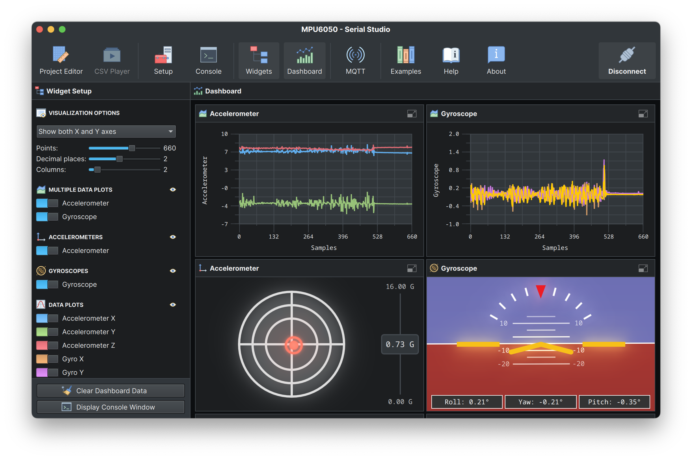

# Serial Studio

<a href="#">
    
</a>

[](https://github.com/Serial-Studio/Serial-Studio/commits/master)
[](https://github.com/Serial-Studio/Serial-Studio/graphs/contributors)
[](https://github.com/Serial-Studio/Serial-Studio/pull/new)
[](https://github.com/Serial-Studio/Serial-Studio/releases/)
[](https://instagram.com/serialstudio.app)
[](https://www.paypal.com/donate?hosted_button_id=XN68J47QJKYDE)

Serial Studio is a multi-platform, versatile data visualization tool designed for embedded engineers, students, hackers, and teachers. It allows users to visualize, analyze, and represent data from their projects and devices without needing custom, project-specific visualization software. Serial Studio offers a flexible solution that adapts to a wide range of use cases, making it ideal for both educational and professional environments.

The tool was born out of my experience in multiple CanSat-based competitions, where I often found myself developing new Ground Station Software for each project. Over time, I realized it would be more efficient and sustainable to maintain a single, flexible Ground Station Software that allows users to define how incoming data is processed and displayed.

Today, Serial Studio is a powerful and adaptable tool, suitable not only for CanSat competitions but for any data acquisition and visualization project. It supports data retrieval from a wide range of sources, including hardware and software serial ports, MQTT, Bluetooth Low Energy (BLE), and network sockets (TCP/UDP).

*Read this document in other languages*: [Español](doc/README_ES.md) [简体中文](doc/README_ZH.md) [Deutsch](doc/README_DE.md) [Русский](doc/README_RU.md) [Français](doc/README_FR.md)



## Features

- **Cross-platform:** Compatible with Windows, macOS, and Linux.
- **CSV Export:** Easily saves received data in CSV files for further analysis or processing.
- **Support for multiple data sources:** Handles a wide variety of sources, including serial ports, MQTT, Bluetooth Low Energy (BLE), and network sockets (TCP/UDP).
- **Customizable visualization:** Allows users to define and display data using various widgets, configurable via the project editor to meet specific needs.
- **Customizable frame analysis:** Provides the option to modify a JavaScript function to interpret incoming data frames, enabling the preprocessing of raw sensor data and handling of complex binary formats.
- **MQTT publishing and receiving:** Sends and receives data over the internet, enabling real-time data visualization from anywhere in the world.

Visit the **[Wiki](https://github.com/Serial-Studio/Serial-Studio/wiki)** for comprehensive guides, including:

- **Installation Instructions:** Set up Serial Studio on Windows, macOS, or Linux.  
- **Quick Start Guide:** Learn how to connect your device and visualize data in minutes.  
- **Advanced Topics:** Explore data flow, frame parsing, and building custom dashboards.
- **Examples:** Examples with code, projects, and explanations to help you learn Serial Studio.

## Development

### Requirements

To compile Serial Studio, the only required dependency is [Qt](http://www.qt.io/download-open-source/), preferrably with all plugins & modules installed. The desktop application compiles with **Qt 6.8.0**.

If you're compiling on GNU/Linux, you’ll also need to install `libgl1-mesa-dev`:

```bash
sudo apt install libgl1-mesa-dev
```

Once Qt is installed, you can compile the project by opening the **CMakeLists.txt** file in your preferred IDE or by using the command line:

```bash
mkdir build
cd build 
cmake ../ 
cmake --build . -j 16
```

## Support & Tipping

Open source software thrives on collaboration, creativity, and the generosity of its users. By supporting Serial Studio, you are directly contributing to its growth, sustainability, and ability to impact countless developers, makers, educators and innovators around the world.

If this project has helped you or inspired you, consider supporting it with a donation. Even small contributions make a big difference. Your generosity will keep this tool evolving and help more people to unlock their potential with open source software.

👉 [Donate/Tip Here](https://www.paypal.com/donate?hosted_button_id=XN68J47QJKYDE)

## License

This project is licensed under the MIT License. For more details, see the [LICENSE](LICENSE.md) file.
