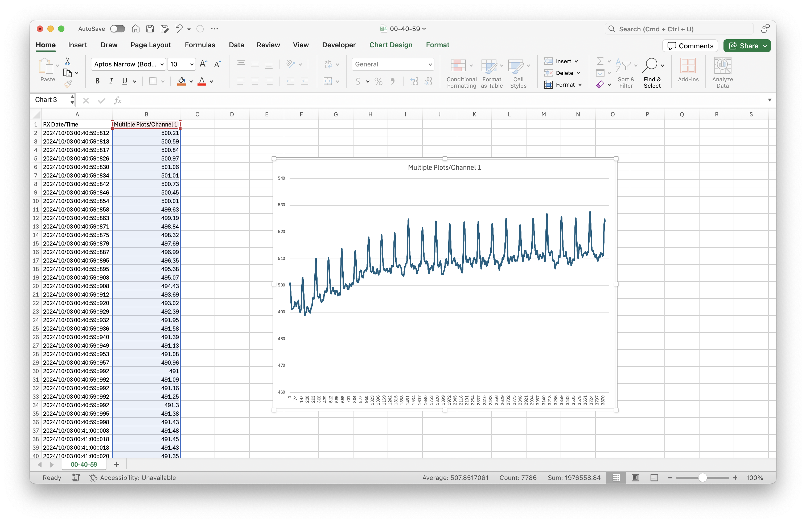

# Pulse Sensor (Photoplethysmogram) + Serial Studio Example

## Overview

This project demonstrates how to use Serial Studio to visualize data from a **heart pulse sensor** connected to an Arduino. The Arduino program reads raw data from the pulse sensor, applies a low-pass filter to remove high-frequency noise, and uses a moving average filter to further smooth the signal. The filtered signal is then transmitted via serial communication for real-time visualization.

With **Serial Studio**, you can use the **Quick Plot** feature to easily visualize the data, similar to the Arduino IDE's Serial Plotter, and also export the data into a playable CSV file for later analysis.

**Compatibility**: This project is compatible with any pulse sensor module connected to an analog pin on an Arduino. The program uses analog pin **A0** for reading the pulse sensor data.

### What is a Photoplethysmogram (PPG)?

A **Photoplethysmogram (PPG)** is a type of signal that measures changes in blood volume in the small blood vessels of the skin. It works by using a light source, like an LED, to shine light on the skin, and a phototransistor to measure how much light is either reflected or passed through the tissue. When the heart beats, the amount of blood in the skin changes, which also affects how much light is absorbed. This variation creates a waveform that shows each heartbeat as a peak.

PPG sensors are often used in pulse oximeters to measure heart rate and estimate blood oxygen levels. They can also provide information related to breathing patterns and blood flow. The PPG waveform can look slightly different depending on where the sensor is placed on the body, as factors such as tissue composition and vascular structure influence the signal.

## Hardware Setup

To get started, you will need a **heart pulse sensor (Photoplethysmogram)** and an Arduino board. Connect the **signal output** of the pulse sensor to the **analog pin A0** of the Arduino.

### Connections

- **Pulse Sensor Signal Output**: Connect to the Arduino's **analog pin A0**.
- **Power and Ground**: Connect the pulse sensor power (VCC) and ground (GND) pins to the Arduino's respective **5V** and **GND** pins.

## Step-by-Step Guide

### 1. Arduino Sketch (`PulseSensor.ino`)

This sketch reads the analog value from the heart pulse sensor, applies filtering, and transmits the filtered data over the serial port.

#### Program Overview:

- **Low-Pass Filtering**: Smooths out high-frequency noise from the raw sensor readings.
- **Moving Average Filtering**: Further smooths the filtered signal to make it more consistent.
- **Serial Output**: The final filtered value is printed via the serial port at a baud rate of **115200**, which can be visualized in Serial Studio.

### Code Structure:

The Arduino sketch reads raw data from the pulse sensor connected to **A0**, then processes it through two stages of filtering:

1. **Low-Pass Filter**: Reduces high-frequency noise.
2. **Moving Average Filter**: Smooths the filtered signal further.

The final filtered signal is printed to the serial port, allowing you to visualize the data using Serial Studio.

### 2. Serial Studio Configuration

#### Using Quick Plot in Serial Studio

1. **Download and Install Serial Studio**:

   Visit [Serial Studio's official website](https://serial-studio.github.io/) to download and install the software.

2. **Open Serial Studio**:

   - Connect your Arduino to your computer.
   - Launch Serial Studio and select the appropriate serial port.
   - Set the **baud rate** to **115200**, which matches the settings in the Arduino sketch.

3. **Enable Quick Plot**:

   - In Serial Studio, click on the **Quick Plot** radio box in the **Setup** pane. This will automatically plot all numerical values received line by line from the serial port, similar to the Arduino IDE's Serial Plotter.
   - The real-time plotting allows you to observe the filtered pulse sensor data visually.

4. **CSV Export**:

   One of the advantages of Serial Studio is that it allows you to export a **playable CSV file** of the serial data, even if you have not created a JSON project. This file can be used for further analysis or for sharing your results.

### 3. Viewing Filtered Pulse Data in Serial Studio

After setting up Serial Studio:

- **Connect to the Arduino**: Ensure the correct serial port is selected, and set the baud rate to **115200**.
- **Visualize the Data**: The filtered pulse signal will be plotted in real-time, giving you a clear view of the pulse waveform.
- **CSV Logging**: You can save the data into a CSV file directly from Serial Studio for offline analysis.

### Troubleshooting Tips

- **No Data in Quick Plot**: Ensure that the pulse sensor is correctly connected and that the serial port and baud rate match the configuration in Serial Studio.
- **Noise in the Plot**: If the data appears noisy, consider adjusting the **low-pass filter coefficient** (`lowPassAlpha`) in the Arduino sketch for a smoother signal.
